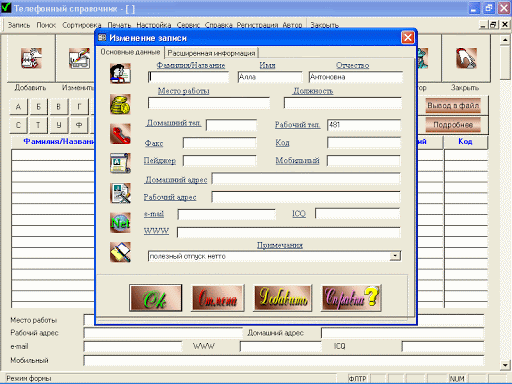
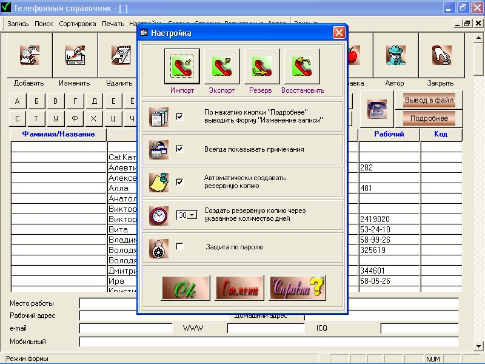
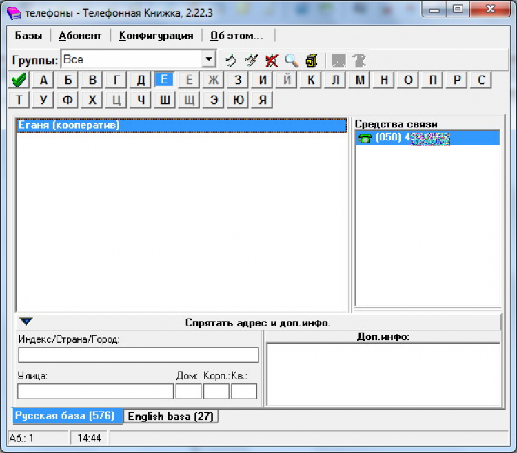
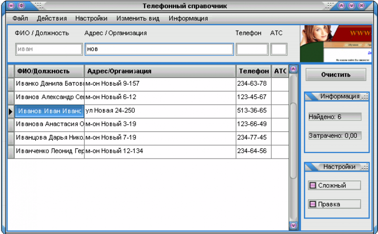
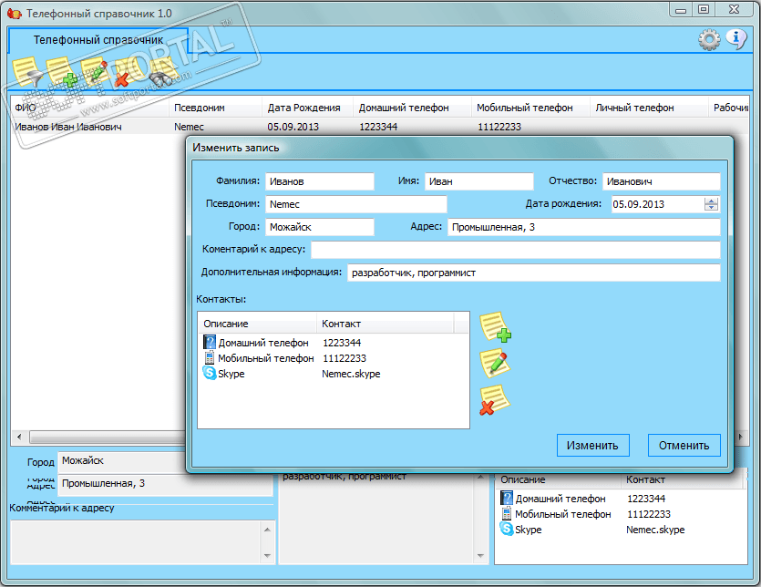

# Обзор аналогов
---

# Содержание 
1 [Обзор приложений](#application_overview)  
1.1 [Телефонный справочник #1](#ts1)  
1.2 [Телефонный справочник #2](#ts2)  
1.3 [Телефонный справочник #3](#ts3)  
1.4 [Телефонный справочник #4](#ts4)  
2 [Сравнение приложений](#comparison_of_applications)

<a name="application_overview"/>

# 1 Обзор приложений

<a name="ts1"/>

## 1.1 Телефонный справочник #1
**Автор программы:** DGSoftware 
**Последняя версия:** 3.97 
**Последнее обновление:** от 11 декабря 2003 г. 
**Версия ОС:** Windows XP/Vista/7/8/10 
**Русский интерфейс:** есть 
**Цена:** 195 RUB 
**Размер программы:** 444.5 Кб 

Окно Телефонный справочник #1  
  

Телефонный справочник – это простой, удобная и лёгкая в использовании адресная книга, база электронных адресов и адресов Интернет, номеров ICQ и другой информации. Телефонный справочник – это ваш личный помощник в хранении и эффективном использовании деловой и личной информации. 
Телефонный справочник предназначен для хранения следующей информации: 
* Фамилий, имён и отчеств;
* Названий организаций;
* Названий групп (поставщики, покупатели, друзья, сослуживцы и т.д.);
* Видов деятельности; 
* Виды продукции или услуг; 
* Дней рождения;
* Телефонных номеров (рабочих и домашних с кодами городов);
* Номеров мобильных телефонов;
* Номеров пейджеров;
* Адресов;
* Мест работы; 
* Должностей; 
* Электронных адресов; 
* Адресов интернет-ресурсов; 
* Номеров ICQ (UIN); 
* Прозвищ, а так же прочей информации.

Окно настроек Телефонный справочник #1  
  

Особенности телефонного справочника: 
- Простота и удобство использования; 
- Приятный внешний вид; 
- Высокая надёжность; 
- Защита ваших данных паролем; 
- Мощная и очень удобная поисковая система; 
- Резервное копирование/восстановление с резервной копии; 
- Высокая скорость работы, благодаря продуманной и простой структуре и использованию полноценной СУБД МS Access; 
- Автоматическая адаптация программы под разрешение вашего монитора; 
- До 5 номеров телефона/факса в одном поле; 
- Набор телефонного номера; 
- Интеграция с почтовой программой, ICQ и WEB-браузером; 
- Экспорт/импорт между базами Телефонного справочника находящимися на разных компьютерах; 
- Экспорт в файлы Excel, HTML, RTF, DOS Text, XML; 
- Печать; 
- Удобная сортировка данных; 
- Справка; 
- Инсталляция и деинсталляция.

<a name="ts2"/>

## 1.2 Телефонный справочник #2
**Версия:** 2.22.3 
**Размер:** 0.48 МБ 
**Разрядность:** 32 и 64 бит 
**Совместимость:** Windows ME, Windows XP, Windows Vista, Windows 7, Windows 8 
**Разработчик:** Александр Чернявский 
**E-mail:** [shuriksoft@mail.ru](shuriksoft@mail.ru) 
**Сайт:** [shuriksoft.ucoz.ru](shuriksoft.ucoz.ru) 
**Русский интерфейс:** есть 
**Цена:** бесплатно 

Окно Телефонный справочник #2  
  

Программа представляет собой электронную записную книжку, в которой можно хранить имена, даты рождения, адреса,телефоны и другую контактную информацию Ваших знакомых и друзей.
Программа позволяет вести несколько записных книжек в разных файлах. Имеется возможность сортировки записей по первой букве имени, по категориям (друзья, знакомые и т.д.), имеется поиск по различным критериям. Также Телефонная книжка позволяет просматривать европейский и японский гороскопы.

Отличительные особенности:
* Возможность ведения нескольких книжек в разных файлах;
* Для доступа к книжке можно установить пароль;
* Позволяет сохранять имена, адреса, номера телефонов, факсов, пейджера, мобильного, а также адреса электронной почты, веб-сайтов, ICQ, Skype и Messenger;
* Возможности сортировки по имени и категории;
* Возможность простого поиска по имени или расширенного поиска;
* Возможность изменения шрифта в списках и в дополнительной информации абонента;
* Содержит возможность переопределения (сортировки) категорий абонентов;
* Можно вести книжку с отдельными записями на русском и английском языках;
* Для каждого абонента, занесённого в книжку можно посмотреть европейский и японский гороскопы;
* Возможна настройка цветов интерфейса и добавление или удаление категорий абонентов;
* Записи можно экспортировать в текстовый файл или MS Word.

<a name="ts3"/>

## 1.3 Телефонный справочник #3
**Русский интерфейс:** есть 
**Цена:** бесплатный 
**Актуальная версия:** 2.1 
**Размер:** 0.82 МБ 
**Разрядность:** 32 и 64 бит 
**Разработчик:** Непомнящий Олег Петрович 
**Сайт:** www.dekan.ru 

Окно Телефонный справочник #3  
  

Программа предназначена для ведения базы данных "Телефонный справочник", позволяет осуществлять мгновенный поиск данных о любых абонентах, имеющих телефон, очень проста в использовании. 
Поиск происходит автоматически после ввода данных. Поиск можно осуществлять по любым, хотя бы частично известным данным - по фамилии, адресу, номеру телефона, а также по любому их сочетанию. Например, в режиме "усложненный поиск" можно найти абонента, имеющего фамилию, оканчивающуюся на "ов", живущего по улице Гагарина и имеющего в номере телефона цифру "7"... 
Программа имеет привлекательный интерфейс, позволяя менять дизайн прямо в процессе работы.  
В отличие от большинства баз данных программа не использует BDE. Поэтому очень компактна и не требует для своей работы никаких дополнительных библиотек. 
При установке и работе не изменяет конфигурацию существующих баз данных и не нуждается в настройках. 

<a name="ts4"/>

## 1.4 Телефонный справочник #4
**Версия:** 1.4.3.1 
**Совместимость:** Windows 10, 8.1, 8, 7, XP 
**Русский интерфейс:** нет  
**Цена:** бесплатный 
**Разработчик:** MaxLim 
**Размер:** 3.52 Мб 

Окно Телефонный справочник #4  
  

Бесплатная, удобная и простая в использовании программа, которая позволяет хранить контакты родных, близких, друзей, коллег по работе и т.д. 
Неограниченное количество контактов позволит заносить множество номеров на одного человека, присутствует встроенный поиск, возможность сортировки списка контактов и многое другое.

<a name="comparison_of_applications"/>

# 2 Сравнение приложений

| Функция | Телефонный справочник #1 | Телефонный справочник #2 | Телефонный справочник #3 | Телефонный справочник #4 |
|:---|:---:|:---:|:---:|:---:|
| Поддержка русского языка | + | + | + | + |
| Бесплатное использование | - | + | + | + |
| Фильтрация по ключевым словам | + | + | + | + |
| Встроенная справка | + | + | + | + |
| Простота использования | + | + | + | + |
| Удобство использования людьми с плохим зрением | - | - | - | - |