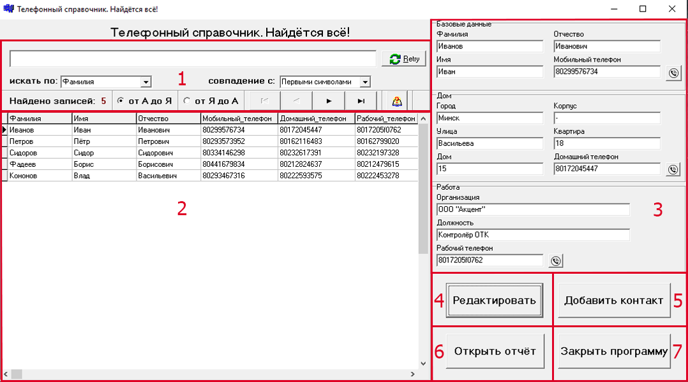

# Требования к проекту
---

# Содержание
1 [Введение](#intro)  
1.1 [Назначение](#appointment)  
1.2 [Бизнес-требования](#business_requirements)  
1.2.1 [Исходные данные](#initial_data)  
1.2.2 [Возможности бизнеса](#business_opportunities)  
1.2.3 [Границы проекта](#project_boundary)  
1.3 [Аналоги](#analogues)  
2 [Требования пользователя](#user_requirements)  
2.1 [Программные интерфейсы](#software_interfaces)  
2.2 [Интерфейс пользователя](#user_interface) 
2.2.1 [Главная форма](#main_form) 
2.2.1.1 [Панель "Глобальный поиск"](#global_search) 
2.2.1.2 [Панель "Список контактов"](#kontakt_list) 
2.2.1.3 [Панель "Блок данных о контакте"](#about_kontakt) 
2.2.1.4 [Кнопка "Редактировать"](#edit) 
2.2.1.5 [Кнопка "Добавить контакт"](#add) 
2.2.1.6 [Кнопка "Открыть отчёт"](#report) 
2.2.1.7 [Кнопка "Закрыть программу"](#close) 
2.3 [Характеристики пользователей](#user_specifications)  
2.3.1 [Классы пользователей](#user_classes)  
2.3.2 [Аудитория приложения](#application_audience)  
2.3.2.1 [Целевая аудитория](#target_audience)  
2.3.2.1 [Побочная аудитория](#collateral_audience)  
2.4 [Предположения и зависимости](#assumptions_and_dependencies)  
3 [Системные требования](#system_requirements)  
3.1 [Функциональные требования](#functional_requirements)  
3.1.1 [Основные функции](#main_functions)  
3.1.1.1 [Вход пользователя в приложение](#user_logon_to_the_application)  
3.1.1.2 [Настройка профиля активного пользователя](#setting_up_the_profile_of_the_active_user)  
3.1.1.3 [Загрузка новостей](#download_news)  
3.1.1.4 [Просмотр информации об отдельной новости](#view_information_about_an_individual_newsletter)  
3.1.1.5 [Выход пользователя из учётной записи](#active_user_change)  
3.1.1.6 [Регистрация нового пользователя после входа в приложение](#add_new_user)  
3.1.2 [Ограничения и исключения](#restrictions_and_exclusions)  
3.2 [Нефункциональные требования](#non-functional_requirements)  
3.2.1 [Атрибуты качества](#quality_attributes)  
3.2.1.1 [Требования к удобству использования](#requirements_for_ease_of_use)  
3.2.1.2 [Требования к безопасности](#security_requirements)  
3.2.2 [Внешние интерфейсы](#external_interfaces)  
3.2.3 [Ограничения](#restrictions)  

<a name="intro"/>

# 1 Введение

<a name="appointment"/>

## 1.1 Назначение
В этом документе описаны функциональные и нефункциональные требования к приложению «Телефонный справочник» для ОС Windows 10. Этот документ предназначен для команды, которая будет реализовывать и проверять корректность работы. 

<a name="business_requirements"/>

## 1.2 Бизнес-требования

<a name="initial_data"/>

### 1.2.1 Исходные данные
В наше время большинство людей старшей возрастной категории до сих пор пользуются бумажными телефонными справочниками. Однако, не каждый человек из представленной возрастной группы может предусмотреть рациональную организацию данных в бумажном телефонном справочнике. Поэтому поиск определённого контакта в таких условиях сопряжено с потерей времени на выборку. В связи с такой ситуацией многие из представителей данной возрастной категории начинают использовать компьютерные технологии для упрощения и рационализации организации телефонных справочников. Большинство из них не обладает достаточной технической грамотностью для использования приложений, рассчитанных на продвинутых пользователей. Это приводит к тому, что многие возвращаются к привычным способам получения информации.

<a name="business_opportunities"/>

### 1.2.2 Возможности бизнеса
Многие люди старшей возрастной категории желают иметь приложение, которое позволит оперативно получать информацию о контактах, обладая минимальной технической грамотностью. Подобное приложение позволит им тратить меньше времени на поиск необходимой информации. Интерфейс, спроектированный с учётом всех особенностей данной возрастной категории, и дополнение приложения подробной инструкцией позволят увеличить количество людей, использующих данное приложение.

<a name="project_boundary"/>

### 1.2.3 Границы проекта
Приложение «Телефонный справочник» позволит пользователям добавлять, удалять, просматривать и редактировать информацию о контактах, отобранных согласно параметрам поиска и сортировки. Также для каждого контакта реализована возможность тонового набора телефонного номера.

<a name="analogues"/>

## 1.3 Аналоги
Обзор аналогов представлен в документе [Overview of analogues](../Requirements/Overview%20of%20analogues.md).

<a name="user_requirements"/>

# 2 Требования пользователя

<a name="software_interfaces"/>

## 2.1 Программные интерфейсы
Приложение, по сути, представляет собой систему управления базой данных. Базой данных, которая содержит и систематизирует персональные свойства объекта (контакта).

<a name="main_form"/>
<a name="user_interface"/>

## 2.2 Интерфейс пользователя
### 2.2.1 Главная форма 
  
Главная форма состоит из следующих компонентов: 

<a name="global_search"/>

#### 2.2.1.1 Панель "Глобальный поиск"
 
    Панель "Глобальный поиск" состоит из следующих компонентов: 
    1. Поисковая строка 
     
        Поисковая строка — это поле, куда пользователь вводит свой запрос. 
        Для поиска, пользователю следует проделать следующие действия:
        1. Активировать поисковую строку.
        2. Ввести свой запрос.

    2. Кнопка очистки содержимого поисковой строки 
     
        Данная кнопка полностью очищает строку поиска и возвращает все записи списка контактов.

    3. Переключатель критерия поиска по полям базы данных 
     
        Пользователь может выбрать критерий по которому вводить свой запрос в строку поиска. 
        Поиск может осуществляться по следующим полям базы данных:
        * Фамилия;
        * Имя;
        * Отчество;
        * Мобильный телефон;
        * Город;
        * Улица;
        * Дом;
        * Корпус;
        * Квартира;
        * Домашний телефон;
        * Организация;
        * Должность;
        * Рабочий телефон.
        
        Для переключения критерия поиска по полям базы данных, пользователю следует проделать следующие действия:
        1. Активировать переключатель критерия поиска по полям базы данных
        2. Выбрать критерий поиска по полям базы данных

    4. Переключатель критерия поиска по совпадению 
     
        Пользователь может выбрать критерий по которому вводить свой запрос в строку поиска. 
        Совпадение может быть с:
        * Первыми символами совпадения по полям базы данных. 
        * Любой частью. В данном случае будут выведены записи начинающиеся с вводимого запроса или содержащие его. 

        Для переключения критерия поиска по совпадению, пользователю следует проделать следующие действия:
        1. Активировать переключатель критерия поиска по совпадению;
        2. Выбрать критерий поиска по совпадению.

    5. Количество найденных контактов 
     
        Данный элемент автоматически отражает количество записей в списке контактов. 
        С учётом: 
        * Запроса, введённого в строку поиска;
        * Критерия поиска по полям базы данных;
        * Критерия поиска по совпадению.

        По умолчанию отображается полное количество контактов в базе данных.

    6. Переключатель сортировки по алфавиту 
     
        При помощи переключателя можно отсортировать список контактов по полю базы данных "Фамилия":
        * от А до Я - по алфавиту;
        * от Я до А - в обратном алфавитном порядке.

    7. Кнопки перехода по найденным контактам 
     
        Данные кнопки реализуют возможность перехода по списку контактов. 
        Список кнопок перехода (слева направо):
        * К началу списка;
        * Назад;
        * Вперёд;
        * К концу списка.

        По умолчанию отображена первая запись в списке контактов.

    8. Кнопка, вызывающее руководство пользователя 
     
        При нажатии на эту кнопку, отобразится руководство пользователя.

<a name="kontakt_list"/>

#### 2.2.1.2 Панель "Список контактов"
 
    Список контактов это таблица, каждая запись которой соответствует записи из таблицы базы данных. 
    По умолчанию отображаются все записи из таблицы базы данных в алфавитном порядке. 
    Отображение найденных записей из таблицы базы данных осуществляется по следующим критериям:
    * Запросу, введённому в строку поиска;
    * Критерию поиска по полям базы данных;
    * Критерию поиска по совпадению;
    * По алфавиту/в обратном алфавитном порядке.

    По списку можно переходить при помощи мышки или соответствующих специальных кнопок. 
    Естественно не все поля базы данных отображены в списке контактов, так как все поля в список просто не поместятся. Это и не нужно. 
    Вся полная информация активного контакта (активной записи) отображена в блоке данных о контакте. 
    При переходе по записям соответственно меняются данные в блоке данных о контакте.

<a name="about_kontakt"/>

#### 2.2.1.3 Панель "Блок данных о контакте"
 
    Панель "Блок данных о контакте" отображает поля активного контакта (активной записи)  и состоит из следующих компонентов: 
    1. Категория "Базовые данные" 
     
        Поля категории "Базовые данные" представляют собой следующие поля активного контакта (активной записи):
        * Фамилия;
        * Имя;
        * Отчество;
        * Мобильный телефон.

    2. Категория "Дом" 
     
        Поля категории "Дом" представляют собой следующие поля активного контакта (активной записи):
        * Город;
        * Улица;
        * Дом;
        * Корпус;
        * Квартира;
        * Домашний телефон.

    3. Категория "Работа" 
     
        Поля категории "Работа" представляют собой следующие поля активного контакта (активной записи):
        * Организация;
        * Должность;
        * Рабочий телефон.

    4. Тональный набор
        Тональный набор (DTMF) - двухтональный многочастотный аналоговый сигнал, используемый для набора телефонного номер.

        В телефонном справочнике, при помощи тонального набора, представлена возможность набрать телефонные номера из полей:
        * Мобильный телефон;
        * Домашний телефон;
        * Мобильный телефон.

        Для тонального набора номера телефона, пользователю следует проделать следующие действия:
        * Нажать на кнопку с соответствующей иконкой  
        * Перевести телефон в тональный режим.
        * Поднести телефон к динамику устройства.
        * Нажать кнопку "ОК" в соответствующем информационном сообщении:
         
        * В случае ошибки набора телефонного номера, будет выведено соответствующие информационное сообщение:
         

<a name="edit"/>

#### 2.2.1.4 Кнопка "Редактировать"
Если нужно отредактировать содержимое полей активной записи, то на главной форме следует нажать кнопку "Редактировать". 
 
    При нажатии кнопки "Редактировать", откроется окно "Редактирование контакта": 
     
    Данное окно представлено следующими элементами:
    * Поля для редактирования данных в активном контакте (активной записи) по категориям 
        Данный элемент полностью дублирует блок данных о контакте с одним лишь различием: данные в полях можно непосредственно редактировать. 
         
    * Кнопка "Сохранить и закрыть" 
         
        При нажатии данной кнопки, все данные в полях для ввода данных нового контакта (новой записи) по категориям будут сохранены в соответствующих полях базы данных, с последующим закрытием окна "Добавление контакта".
    * Кнопка "Отменить и закрыть" 
         
        При нажатии данной кнопки, все данные в полях для ввода данных нового контакта (новой записи) по категориям не будут сохранены в соответствующих полях базы данных, с последующим закрытием окна  "Добавление контакта".
    * Кнопка "Удалить запись и закрыть" 
         
        При нажатии данной кнопки, все данные активного контакта (активной записи) будут удалены из базы данных, с последующим закрытием окна "Редактирование контакта".

<a name="add"/>

#### 2.2.1.5 Кнопка "Добавить контакт"
Если нужно добавить контакт, то на главной форме следует нажать кнопку "Добавить контакт". 
 
    При нажатии кнопки "Добавить контакт", откроется окно "Добавление контакта". 
     
    Данное окно представлено следующими элементами:
    * Поля для ввода данных нового контакта по категориям. 
        Данный элемент полностью дублирует блок данных о контакте с некоторыми различиями: поля пусты и данные в полях можно непосредственно редактировать.
         
        Необязательно сразу заполнять все поля, в любом случае существует возможность их дозаполнить при редактировании данных о контакте.
    * Кнопка "Сохранить и закрыть"; 
         
        При нажатии данной кнопки, все данные в полях для ввода данных нового контакта (новой записи) по категориям будут сохранены в соответствующих полях базы данных, с последующим закрытием окна "Добавление контакта".
    * Кнопка "Отменить и закрыть". 
         
        При нажатии данной кнопки, все данные в полях для ввода данных нового контакта (новой записи) по категориям не будут сохранены в соответствующих полях базы данных, с последующим закрытием окна  "Добавление контакта".

<a name="report"/>

#### 2.2.1.6 Кнопка "Открыть отчёт"
Для создания отчёта, нужно нажать на кнопку "Открыть отчёт". 
 
    При нажатии на данную кнопку, в шаблоне программы для работы с электронными таблицами Microsoft Excel, будет создан от отчёт, где каждое поле соответствует полю активной записи на основании которой был создан данный отчёт. 
     

<a name="close"/>

#### 2.2.1.7 Кнопка "Закрыть программу"
 
При нажатии на кнопку "Закрыть программу", будет осуществлён выход из программы.

<a name="user_specifications"/>

## 2.3 Характеристики пользователей

<a name="user_classes"/>

### 2.3.1 Классы пользователей

| Класс пользователей | Описание |
|:---|:---|
| Анонимные пользователи | Имеют доступ к полному функционалу |

<a name="application_audience"/>

### 2.3.2 Аудитория приложения

<a name="target_audience"/>

#### 2.3.2.1 Целевая аудитория
Люди старшей возрастной категории со средним или выше среднего уровнем образования, обладающие минимальной технической грамотностью.

<a name="collateral_audience"/>

#### 2.3.2.2 Побочная аудитория
Люди средней возрастной категории, обладающие вышеперечисленными качествами.

<a name="assumptions_and_dependencies"/>

## 2.4 Предположения и зависимости
1. Приложение не требует подключения к Интернету;
2. Приложение блокируется во время тонального набора телефонного номера (DTMF).

<a name="system_requirements"/>

# 3 Системные требования

<a name="functional_requirements"/>

## 3.1 Функциональные требования

<a name="main_functions"/>

### 3.1.1 Основные функции

<a name="user_logon_to_the_application"/>

#### 3.1.1.1 Вход пользователя в приложение
**Описание.** Пользователь имеет возможность пользоваться приложением без создания собственного профиля.

<a name="setting_up_the_profile_of_the_active_user"/>

#### 3.1.1.2 Настройка профиля активного пользователя
**Описание.** Пользователь имеет возможность редактировать список контактов, с которых производится выборка новостей, и списки (включений и исключений) ключевых фраз для фильтрации новостей.

| Функция | Требования | 
|:---|:---|
| Добавление интернет-ресурсов | Приложение должно предоставить зарегистрированному пользователю поле для ввода адреса RSS-ленты интернет-ресурса. Пользователь должен либо ввести адрес и подвердить действие, либо отменить его |
| Удаление интернет-ресурсов | Зарегистрированный пользователь имеет возможножность выделить адрес RSS-ленты в списке интернет-ресурсов и удалить его |
| Добавление ключевых фраз | Приложение должно предоставить зарегистрированному пользователю возможность выбрать список, в который будет добавлена фраза, и поле для её ввода. После выбора списка пользователь должен либо ввести фразу и подвердить действие, либо отменить его |
| Удаление ключевых фраз | Зарегистрированный пользователь имеет возможность выделить ключевую фразу в любом из списков и удалить её |

<a name="download_news"/>

#### 3.1.1.3 Загрузка новостей
**Описание.** После входа пользователя в приложение или после завершения радактирования профиля зарегистрированным пользователем необходимо загрузить информацию о новостях и отфильтровать их согласно спискам ключевых фраз.

| Функция | Требования | 
|:---|:---|
| Загрузка информации о новостях | Приложение должно загрузить информацию о новостях с интернет-ресурсов после входа пользователя в приложение или после завершения радактирования профиля зарегистрированным пользователем |
| Фильтрация новостей | Приложение должно отфильтровать новости согласно спискам ключевых фраз |

<a name="view_information_about_an_individual_newsletter"/>

#### 3.1.1.4 Просмотр информации об отдельной новости
**Описание.** Пользователь имеет возможность просмотреть информацию о каждой новости, представленной в таблице.

| Функция | Требования | 
|:---|:---|
| Просмотр краткой информации | Пользователь имеет возможность выбрать новость в таблице одинарным кликом по ней. Приложение должно отобразить её заголовок, описание и дату размещения "Подробнее" главного окна приложения |
| Просмотр подробной информации | Пользователь имеет возможность выбрать новость в таблице двойным кликом по ней. Приложение должно открыть полную версию страницы в браузере, установленном в системе по умолчанию |

<a name="active_user_change"/>

#### 3.1.1.5 Выход зарегистрированного пользователя из учётной записи
**Описание.** Зарегистрированный пользователь имеет возможность выйти из учётной записи.

**Требование.** Приложение должно предоставить зарегистрированному пользователю возможность выйти из учётной записи с возвратом к окну входа в приложение.

<a name="add_new_user"/>

#### 3.1.1.6 Регистрация нового пользователя после входа в приложение
**Описание.** Анонимный пользователь имеет возможность зарегистрироваться в приложении.

**Требование.** Приложение должно предоставить анонимному пользователю возможность [зарегистрироваться в приложении](#registration_requirements). 

<a name="restrictions_and_exclusions"/>

### 3.1.2 Ограничения и исключения
1. Приложение работает только при наличии подключения к Интернету;
2. Отслеживание новостей интернет-ресурса осуществляется при наличии у последнего RSS-ленты. 

<a name="non-functional_requirements"/>

## 3.2 Нефункциональные требования

<a name="quality_attributes"/>

### 3.2.1 Атрибуты качества

<a name="requirements_for_ease_of_use"/>

#### 3.2.1.1 Требования к удобству использования
1. Доступ к основным функциям приложения не более чем за две операции;
2. Все функциональные элементы пользовательского интерфейса имеют названия, описывающие действие, которое произойдет при выборе элемента;
3. Пошаговая инструкция использования основных функций приложения отображена в справке;
4. Обновление информации о новостях происходит каждые 15 минут в фоновом режиме.

<a name="security_requirements"/>

#### 3.2.1.2 Требования к безопасности
Приложение предоставляет возможность просмотра и редактирования профиля только активного пользователя.

<a name="external_interfaces"/>

### 3.2.2 Внешние интерфейсы
Окна приложения удобны для использования пользователями с плохим зрением:
  * размер шрифта не менее 14пт;
  * функциональные элементы контрастны фону окна.

<a name="restrictions"/>

### 3.2.3 Ограничения
1. Приложение реализовано на платформе .NET Framework 4.6;
2. Профиль пользователя хранится в файле с расширением XML, название файла совпадает с именем (псевдонимом).